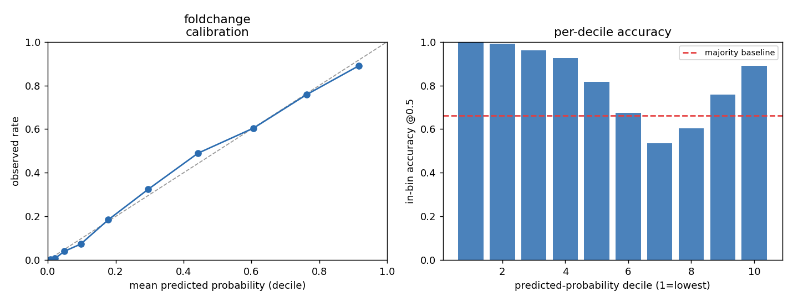
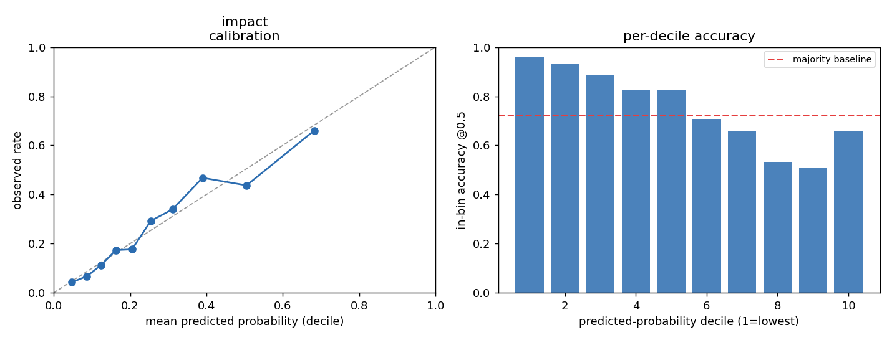

# DOMAS calibrated scores — model cards

DOMAS emits two **calibrated probability** scores alongside the categorical `impact`
level, one per axis of alternative-splicing consequence:

| score | axis | question it answers | gene-grouped AUC |
|-------|------|---------------------|:----------------:|
| **`fold_change_prob`** | structural | Does the alternative isoform adopt a *different 3-D fold*? | **0.894** |
| **`impact_prob`** | functional | Is the changed region *functionally important* (pathogenic-variant-like)? | **0.766** |

They are deliberately different questions ("fold-vs-function duality"): a change can
preserve the fold yet abolish function, or wreck the fold while being biologically
silent. Each score is a logistic regression over a small set of interpretable features,
**natively calibrated** (a predicted 0.6 really means ~60%), reported throughout under
**gene-grouped 5-fold cross-validation** (every isoform of a gene is confined to one
fold, so no protein appears in both train and test — no leakage).

Everything below is reproduced end-to-end by [`reproduce_models.py`](reproduce_models.py)
(see §5).

**Contents**

1. Shared benchmark, labels, and methodology — *incl. 1.1 the two training/evaluation methods*
2. `fold_change_prob` — structural axis
3. `impact_prob` — functional axis
4. Why these features and not others (audit trail)
5. Reproduction
6. Review checklist / essentials
- Appendix A — Every feature evaluated, and where it comes from
- Appendix B — Comparable published methods

---

## 1. Shared benchmark, labels, and methodology

**Benchmark dataset.** Miller et al., *Predicting the structural impact of human
alternative splicing*, **Genome Biology 2025** (doi:10.1186/s13059-025-03744-x). One
row = **one canonical-vs-alternative-isoform splicing event**. After dropping pure
insertions (no canonical changed region to score), **10,227 pairs across 5,557 human
proteins**.

**Label sources — what they are and what they mean:**

| label | source | meaning | used by |
|-------|--------|---------|---------|
| **TM-score** | The paper folded every canonical and alternative isoform with **AlphaFold2** and computed the pairwise TM-score (Table S4). | Structural-similarity of two folds, 0–1. **TM < 0.5 = different fold; ≥ 0.5 = same fold.** The structural ground truth. | `fold_change_prob` |
| **humsavar** | UniProt **humsavar** disease-variant catalogue (aggregates ClinVar/OMIM), single-residue variants in **canonical protein coordinates**, classed **LP/P** (pathogenic) or **LB/B** (benign). | A changed region "overlaps a pathogenic/benign variant" if a LP/P / LB/B position falls inside it. | `impact_prob` |

**Evaluation protocol.** L2-regularised logistic regression; features standardised
(z-scored); missing features imputed to the training median. Metrics:
- **AUC** — ROC-AUC (rank/threshold-independent; 0.5 = chance).
- **accuracy** — at decision threshold 0.5.
- **R²** — for `fold_change_prob`, variance of the *continuous* TM-score explained by a
  ridge regressor on the same features; for `impact_prob` (a binary target), the
  variance of the 0/1 label explained by the predicted probability (label-R², lower by
  construction).

**Feature provenance** (each feature, and where its value comes from):

| feature | what it is | source |
|---------|-----------|--------|
| `pae_global` | mean **Predicted Aligned Error** over the whole *canonical* AlphaFold structure — how rigidly/confidently the fold is assembled | AlphaFold DB `predicted_aligned_error_v6.json` → `afdb_pae` |
| `identity` | % sequence identity between canonical and alternative protein, from the trimmed changed region | UniProt reference proteome + varsplic sequences |
| `max_cov_loss` | maximum **Pfam** domain coverage (%) lost in the changed region | HMMER `hmmsearch --cut_ga` vs Pfam-A → `pfam_match` |
| `protL` | canonical protein length (aa) | UniProt sequence |
| `region_am` | mean **AlphaMissense** pathogenicity over the changed region | AlphaMissense per-residue → `am_pathogenicity` |
| `loeuf` | gnomAD **LOEUF** gene loss-intolerance (lower = more constrained) | gnomAD v2.1.1 by-gene → `gene_constraint` |
| `buried_frac` | fraction of the changed region **buried** (RSA < 0.25) in the canonical structure | AlphaFold DB model → Shrake–Rupley RSA → `afdb_rsa` |

### 1.1 Two training / evaluation methods (and their agreement)

The script evaluates each model two ways so the honesty of the headline numbers can be
checked:

- **Method 1 — gene-grouped 5-fold CV** (the reported/shipped method). All isoforms of
  a gene are confined to a single fold, so no protein appears in both train and test.
  This is the leakage-free estimate and matters because a gene-level feature (`loeuf`)
  and correlated same-gene isoforms could otherwise leak.
- **Method 2 — random 80/20 hold-out** (pair-level). A single random 80% train / 20%
  test split, ignoring gene membership. This is the naive method; if it scored much
  higher than Method 1 it would reveal same-gene leakage.

**They agree closely — the small gap confirms leakage is minimal:**

| model | metric | Method 1 (gene-grouped CV) | Method 2 (random 80/20) | Δ (holdout − grouped) |
|-------|--------|:--------------------------:|:-----------------------:|:---------------------:|
| `fold_change_prob` | AUC | 0.894 | 0.898 | +0.005 |
| | accuracy | 0.815 | 0.816 | +0.001 |
| | R² | 0.659 | 0.677 | +0.018 |
| `impact_prob` | AUC | 0.766 | 0.778 | +0.012 |
| | accuracy | 0.750 | 0.730 | −0.020 |
| | R² | 0.175 | 0.189 | +0.014 |

The random split is *slightly* optimistic on AUC/R² (≤ +0.018), the expected mild effect
of same-gene pairs landing in both train and test; accuracy even drops for `impact_prob`
(single-split noise on 655 test rows). All gaps are ≤ 0.02, so the two methods give
essentially the same answer — **the gene-grouped numbers are honest, not inflated by
leakage.** They are reported as the headline because they are the conservative estimate;
Method 2 is a single-split point estimate (higher variance) shown only for contrast.

---

## 2. `fold_change_prob` — structural axis

**What it measures.** Calibrated P(the alternative isoform adopts a **different fold**,
TM-score < 0.5).

**How it's measured / label.** Trained and evaluated against the paper's AlphaFold2
TM-score (§1). TM < 0.5 is the positive class.

**Features & standardized coefficients** (`utils._FOLD_CHANGE_MODEL`; larger |coef| =
more influence):

| feature | std. coef | direction |
|---------|:---------:|-----------|
| **`pae_global`** | **+1.96** | floppier / multi-domain canonical structure → more fold change (dominant) |
| `identity` | −0.68 | more sequence conserved → fold preserved |
| `max_cov_loss` | +0.65 | more Pfam domain lost → more fold change |
| `protL` | −0.54 | longer protein → fold preserved (larger scaffold) |
| *intercept* | −1.26 | |

*(raw feature medians `[17.13, 75.0, 11.0, 388.0]`, means `[16.59, 66.36, 33.22, 379.18]`,
std `[7.12, 28.02, 39.28, 134.36]` for the four features in order.)*

**Performance.** Base rate P(TM<0.5) = 0.338, so the majority-class accuracy baseline is
0.662.

| operating point | AUC | accuracy | R² | coverage |
|-----------------|:---:|:--------:|:--:|:--------:|
| **all events (no band)** | **0.894** | **0.815** | **0.659** | 100% |
| suggested band applied (route 0.40–0.60 to folding) | **0.913** | **0.854** | **0.686** | 88% called |

**Suggested query band: route `fold_change_prob` ∈ [0.40, 0.60] to real folding**
(ESMFold/ColabFold) instead of forcing a call. Rationale, visible in the decile table
and the right-hand graph below: the middle deciles (7–8, prob ≈ 0.37–0.69) are where the
model degrades to a **coin flip** — in-bin accuracy dips to 0.54, *below* the 0.662
majority baseline — because these are the "does the remainder re-fold?" cases (the SRP9
class) that cheap features provably cannot resolve. Abstaining on that ~12% lifts the
called-set accuracy 0.815 → 0.854 and AUC 0.894 → 0.913. Widen to 0.30–0.70 for
higher-stakes screening.

**Decile calibration** (events sorted by predicted probability into 10 equal bins):

| decile | prob range | mean pred | observed rate | n | in-bin acc@0.5 |
|:------:|:----------:|:---------:|:-------------:|:---:|:--------------:|
| 1 | 0.001–0.013 | 0.007 | 0.004 | 1023 | 0.996 |
| 2 | 0.013–0.032 | 0.022 | 0.008 | 1023 | 0.992 |
| 3 | 0.032–0.067 | 0.048 | 0.040 | 1023 | 0.960 |
| 4 | 0.067–0.133 | 0.097 | 0.073 | 1023 | 0.927 |
| 5 | 0.133–0.230 | 0.178 | 0.185 | 1023 | 0.815 |
| 6 | 0.230–0.367 | 0.296 | 0.325 | 1023 | 0.675 |
| 7 | 0.367–0.524 | 0.443 | 0.490 | 1023 | **0.536** |
| 8 | 0.524–0.685 | 0.606 | 0.605 | 1022 | 0.605 |
| 9 | 0.685–0.847 | 0.763 | 0.758 | 1022 | 0.758 |
| 10 | 0.848–0.991 | 0.917 | 0.890 | 1022 | 0.890 |

Predicted ≈ observed in every decile (well-calibrated). The U-shaped accuracy — high at
both confident tails, coin-flip in the middle — is the signature that motivates the band.



**Caveats.**
- **Confounded mechanism.** Part of `pae_global`'s power is that a TM-score between two
  *low-confidence* AlphaFold models is low almost by construction. So a high canonical
  PAE partly flags "this TM is unreliable" as much as "a real fold change occurred." It
  is still non-circular (canonical-only, computed independently of the label) and
  prospectively available, but read it as "confidence the fold is well-defined enough to
  compare," not a pure fold-change detector.
- **Per-protein prior.** `pae_global` is a whole-canonical-structure property, identical
  for every isoform of a gene — it sets a per-protein baseline; only `identity`,
  `max_cov_loss`, `protL` differentiate isoforms of the same gene.
- **Known blind spot.** High-identity / low-TM outliers (≈10% of pairs: identity ≥ 80%
  yet TM < 0.5 — the SRP9 class) are confidently mis-called *preserved*; these sit
  *outside* the routing band, so pair the band with a "high-identity AND exposed region"
  trigger for high-stakes use.
- **Scope.** Pure insertions are excluded (no canonical changed region). The ceiling for
  cheap features is ~AUC 0.90; the residual genuinely needs the isoform folded.

---

## 3. `impact_prob` — functional axis

**What it measures.** Calibrated P(the changed region is **pathogenic-variant-like**).
Concretely, among changed regions that overlap *some* curated variant, P(it is the
**pathogenic** one rather than the benign one). It is an **enrichment / prioritisation**
signal ("look here first"), **not** a per-event clinical classifier.

**How it's measured / label.** Restricted to regions overlapping a humsavar LP/P or LB/B
variant; label = 1 if pathogenic-overlapping, 0 if only benign-overlapping. 3,276
regions. (The benign class is the specificity control — a real functional score must
enrich pathogenic, not merely variant-dense, regions.)

**Features & standardized coefficients** (`utils` impact model):

| feature | std. coef | direction |
|---------|:---------:|-----------|
| **`region_am`** | **+0.80** | higher AlphaMissense constraint → pathogenic (dominant) |
| `loeuf` | −0.42 | more loss-intolerant gene (lower LOEUF) → pathogenic |
| `buried_frac` | +0.24 | buried / structured region → pathogenic |
| `max_cov_loss` | −0.06 | ~no effect |
| *intercept* | −1.19 | |

*(raw medians `[0.482, 0.983, 41.0, 0.340]`, means `[0.482, 0.979, 46.07, 0.309]`,
std `[0.155, 0.443, 41.01, 0.219]`.)*

**Performance.** Base rate P(pathogenic | overlaps a variant) = 0.277 → majority baseline
0.723.

| operating point | AUC | accuracy | R² | coverage |
|-----------------|:---:|:--------:|:--:|:--------:|
| **all events (no band)** | **0.766** | **0.750** | **0.175** | 100% |
| abstain on 0.40–0.60 | **0.770** | **0.793** | **0.181** | 85% called |

**Suggested use / band.** Treat `impact_prob` as a **triage/prioritisation** score, not a
verdict: the **top decile (prob ≳ 0.58)** is ~66% pathogenic — "review these first"; the
**bottom deciles (prob ≲ 0.11)** are ~5–7% pathogenic — reliably de-prioritised; the
**0.40–0.60** middle is genuinely ambiguous and should go to manual curation. Abstaining
on the middle raises called-set accuracy 0.750 → 0.793 (AUC barely moves — the tails are
where the signal is). Do **not** use it to call an individual variant pathogenic.

**Decile calibration:**

| decile | prob range | mean pred | observed rate | n | in-bin acc@0.5 |
|:------:|:----------:|:---------:|:-------------:|:---:|:--------------:|
| 1 | 0.019–0.068 | 0.047 | 0.043 | 328 | 0.957 |
| 2 | 0.068–0.107 | 0.087 | 0.067 | 328 | 0.933 |
| 3 | 0.107–0.143 | 0.124 | 0.113 | 328 | 0.887 |
| 4 | 0.143–0.184 | 0.163 | 0.174 | 328 | 0.826 |
| 5 | 0.184–0.227 | 0.205 | 0.177 | 328 | 0.823 |
| 6 | 0.227–0.281 | 0.254 | 0.293 | 328 | 0.707 |
| 7 | 0.281–0.345 | 0.311 | 0.339 | 327 | 0.661 |
| 8 | 0.345–0.436 | 0.390 | 0.468 | 327 | 0.532 |
| 9 | 0.438–0.576 | 0.505 | 0.437 | 327 | 0.508 |
| 10 | 0.576–0.911 | 0.683 | 0.661 | 327 | 0.661 |



**Caveats.**
- **Semi-circular (the biggest one).** `region_am` (AlphaMissense) is itself a
  pathogenicity predictor and dominates the model (+0.80), so part of the signal is built
  in. The **non-circular** contributors are `loeuf` (gnomAD constraint) and `buried_frac`
  (structure). Read the score as "concentrates known functional signals," not independent
  evidence.
- **Positive-only labels.** "No known pathogenic variant" is not proof of neutrality — so
  these are recall/enrichment results, not true specificity.
- **Region-length confound.** On *raw* variant-overlap presence, region length dominates
  (bigger change → more residues → more overlap); `impact_prob` is trained
  length-controlled (patho-vs-benign among overlapping regions) precisely to avoid
  measuring size instead of function. Do not add sequence-identity/length as a feature —
  it would inflate AUC while measuring region size.
- **Not a classifier.** Both classes pile into moderate/high probabilities; specificity
  is limited. It ranks/prioritises; it does not adjudicate.

---

## 4. Why these features and not others (audit trail)

Both feature sets are the survivors of an exhaustive search (EXPERIMENTS.md, E1–E44).
Key negatives worth knowing for review:
- **PAE dominates fold change** and was the single biggest lever (AUC 0.78 → 0.90); it was
  *assumed* redundant for years and only helped when finally measured.
- **`buried_frac` is functional-only; `pae_global` is structural-only** — each was tested
  on the *other* axis and rejected (drop-column ≈ 0 or fails the benign control). The two
  models are cleanly separated.
- **Rejected / redundant:** ESM-2 embeddings (help fold change but not shipped — heavy),
  650M vs 150M ESM (≈equal), region pLDDT (0.79-correlated with burial), contacts
  (redundant with burial), phyloP (only a small structural add, small sample), peak-AM,
  tree/NN model families, multi-task. None beat the shipped logistic on its own axis.

---

## 5. Reproduction

[`reproduce_models.py`](reproduce_models.py) reproduces every number and both graphs in
this document. It:
1. **Downloads** (into `./repro_data/`, ~30 MB, no DoChaP DB needed): UniProt human
   reference proteome + varsplic (sequences → `identity`, `protL`, changed region),
   UniProt humsavar (functional labels), gnomAD v2.1.1 by-gene constraint (`loeuf`).
2. **Reuses** the committed per-pair feature CSVs in this folder (their raw provenance —
   AlphaFold DB, AlphaMissense, Pfam — is documented in `DATA_SOURCES.md`):
   `full_pairs.csv` (TM label + changed region), `pae_features_full.csv` (`pae_global`),
   `bench_rich_results.csv` (`region_am`, `max_cov_loss`), `full_features.csv`
   (`buried_frac`).
3. **Trains + tests** both models by both methods of §1.1 (gene-grouped CV and random
   80/20), prints coefficients (which match the shipped `utils` models), overall +
   banded metrics, the method comparison, and the decile tables, and writes
   `model_card_foldchange.png` / `model_card_impact.png`.

```
cd alphafold_benchmark && python3 reproduce_models.py            # everything, both models, both methods
python3 reproduce_models.py --download-only                      # just fetch inputs into repro_data/ and exit
python3 reproduce_models.py --models fold_change --methods grouped   # one model, one method
python3 reproduce_models.py --methods holdout --seed 7            # only the random 80/20 split, seed 7
python3 reproduce_models.py --no-graphs                           # skip the PNGs
```

Flags: `--models {fold_change,impact,both}`, `--methods {grouped,holdout,both}`,
`--download-only`, `--no-graphs`, `--seed N` (hold-out split seed).

---

## 6. Review checklist / essentials

- **Intended use.** Screening/prioritising alternative-splicing events at scale:
  `fold_change_prob` for "does the fold change," `impact_prob` for "is the changed region
  functionally important." Both are triage signals feeding human/structural review.
- **Out of scope.** Not a clinical variant classifier; not validated on non-human
  proteins; not for pure insertions; not a substitute for folding the isoform when the
  score is in the uncertain band.
- **Leakage control.** Gene-grouped CV throughout (all isoforms of a gene in one fold);
  `loeuf` is gene-level so pair-level CV would leak — the gene-grouped numbers are the
  honest ones.
- **Class balance.** fold change: 33.8% positive (majority acc 0.662). functional: 27.7%
  pathogenic among overlapping regions (majority acc 0.723). Always compare model accuracy
  to these baselines, not to 0.5.
- **Calibration.** Both are logistic (natively calibrated); the decile tables show
  predicted ≈ observed in every bin.
- **Known failure modes.** fold change: high-identity/low-TM re-folders (SRP9 class),
  outside the band. functional: both variant classes pile high (limited specificity);
  semi-circular via AlphaMissense.
- **Versioning.** Coefficients live in `code/utils.py` (`_FOLD_CHANGE_MODEL` and the
  impact model), regenerated by `fit_foldchange_pae.py` / `fit_calibrated.py`. Card
  reflects the current shipped models; base benchmark = Genome Biology 2025.
- **Provisioning dependency.** `fold_change_prob` needs the `afdb_pae` table
  (`build.py -source afdb_pae`); if absent, `pae_global` imputes to the training median and
  the score degrades gracefully toward an identity/coverage-only prediction.

---

## Appendix A — Every feature evaluated, and where it comes from

The two shipped feature sets are the survivors of the full investigation (EXPERIMENTS.md,
E1–E44). This appendix catalogues **all** features that were built and tested — shipped
and rejected — grouped by data source, with what each is and why it did or didn't make
the cut. "S" = in `fold_change_prob` (structural); "F" = in `impact_prob` (functional).

**Sequence-derived** (UniProt reference proteome + `uniprot_sprot_varsplic`):

| feature | what it is | status |
|---------|-----------|--------|
| `identity` | % sequence identity between canonical and alternative protein, from the trimmed changed region | **shipped (S)** — #2 structural feature |
| `protL` | canonical protein length (aa) | **shipped (S)** — small real add |
| `reglen` | length (aa) of the changed region | dropped — it is the region-length confound; deliberately excluded (would measure size, not function) |

**Canonical-AlphaFold-structure-derived** (AlphaFold DB model + its confidence files):

| feature | what it is | source | status |
|---------|-----------|--------|--------|
| `pae_global` | mean Predicted Aligned Error over the whole canonical structure (fold rigidity/confidence) | AFDB `predicted_aligned_error_v6.json` → `afdb_pae` | **shipped (S)** — dominant feature (the biggest lever, AUC 0.78→0.90) |
| `buried_frac` | fraction of the changed region buried (RSA < 0.25) | AFDB model → Shrake–Rupley RSA → `afdb_rsa` | **shipped (F)** — functional (buried → pathogenic-rich) |
| `mean_rsa` | mean relative solvent accessibility of the changed region | same as above | dropped — near-duplicate of `buried_frac` |
| `pae_reg2rest` | mean PAE between the changed region and the rest of the fold (region-specific rigidity) | AFDB PAE | dropped — strong alone (AUC 0.73) but redundant with `pae_global` in the full model |
| `region_plddt` | mean per-residue pLDDT of the changed region (local order/confidence) | AFDB model b-factors → `afdb_plddt` | dropped — 0.79-correlated with `buried_frac`; +0.001 functional / +0.002 structural |
| `helix_frac` / `strand_frac` / `structured_frac` | DSSP secondary-structure fractions of the changed region | AFDB model → pydssp | dropped — small, subsumed by burial/PAE |
| contact density | Cβ<8 Å contacts from the changed region to the rest of the fold | AFDB model coordinates | dropped — redundant with burial (partial corr collapses after burial) |
| `dist_term` / `rel_center` / `frac_before` / `is_terminal` | position of the changed region relative to the protein termini | changed-region coords + `protL` | dropped — +0.017 structural *before* PAE, but PAE absorbs it (+0.002 after) |

**Isoform-AlphaFold-structure-derived** (from Miller et al. Genome Biology 2025 Table S4 —
computed from the *isoform's own* AF2 fold, hence **circular** for predicting TM):

| feature | what it is | status |
|---------|-----------|--------|
| iso helix/sheet/loop, radius of gyration, surface charge, IDR % | global structural descriptors of the alternative isoform's predicted fold | dropped — predict TM at AUC 0.92 but **circular** (need the isoform folded, i.e. already have TM) |
| PTM-change counts (`ptm_added`, buried↔exposed, `ptm_missed`) | how the isoform gains/loses/relocates canonical PTM sites | dropped — non-circular but +0.002 functional (redundant with `region_am`/length) |
| charge / radius deltas | canonical-vs-isoform change in charge / radius of gyration | dropped — ~0 contribution |

**Protein language model** (ESM-2, run over the sequences):

| feature | what it is | status |
|---------|-----------|--------|
| ESM-2 150M / 650M region + (canonical−alt) difference embeddings (mean-pooled, PCA-50) | learned sequence representation of the changed region | tested — *breaks the structural ceiling* (AUC 0.79→0.82) but heavy to provision; **not shipped**. 650M ≈ 150M. |
| ESM multi-pool (mean+max+std+first+last token) | positional pooling of per-residue embeddings | dropped — equal to mean-pooling |

**Variant / constraint databases:**

| feature | what it is | source | status |
|---------|-----------|--------|--------|
| `region_am` | mean AlphaMissense pathogenicity over the changed region | AlphaMissense → `am_pathogenicity` | **shipped (F)** — dominant functional feature |
| `loeuf` | gnomAD gene loss-intolerance (lower = more constrained) | gnomAD v2.1.1 by-gene → `gene_constraint` | **shipped (F)** — non-circular constraint signal |
| `pLI` | gnomAD probability of LoF-intolerance | gnomAD | dropped — weaker than LOEUF |
| peak-AM / mean-of-top-K AM | hotspot AlphaMissense instead of regional mean | AlphaMissense | dropped — regional mean beats every peak (domain-scale regions) |
| `func_site` | whether the region overlaps a curated UniProt functional residue | UniProt features | used in the *categorical* `impact` only (semi-circular for the probability) |

**Domain / coverage:**

| feature | what it is | source | status |
|---------|-----------|--------|--------|
| `max_cov_loss` | maximum Pfam domain coverage (%) lost in the changed region | HMMER `hmmsearch --cut_ga` vs Pfam-A → `pfam_match` | **shipped (S and F)** — the one feature in both models (opposite signs) |
| `fold_state` | folded / disordered, from UniProt HELIX/STRAND/disorder annotation | UniProt features | used upstream in the categorical `impact` |

**Cross-species conservation:**

| feature | what it is | source | status |
|---------|-----------|--------|--------|
| phyloP (region / whole-protein mean) | evolutionary conservation of the changed region | UCSC hg38 100-way phyloP bigWig + EBI coordinates API | tested — a small structural add (+0.037 AUC on a 363-pair sample); not shipped pending scale-up |

**Not available:** **NMD (nonsense-mediated decay)** — DoChaP filters NMD-targeted
transcripts at DB-build time, so degraded isoforms never reach the benchmark; NMD is
neither a feature nor a confound here.

---

## Appendix B — Comparable published methods

We looked for published methods attempting each task and compare them below. A recurring
theme: for the **structural** axis the prior work *folds every isoform* (expensive) and
*catalogues* the result, whereas DOMAS *predicts* the fold-change label from cheap
canonical-only features; for the **functional** axis the closest analogues score exon /
isoform importance from protein + conservation + expression features, on labels that are
related but not identical to ours (so AUCs are not head-to-head).

### B.1 Structural axis — `fold_change_prob`

| method | approach | reported result | relation to ours |
|--------|----------|-----------------|-------------------|
| **Miller et al., *Genome Biology* 2025** (our label source) | Fold all 11,161 human isoforms with **AlphaFold2**; compare each to its canonical with TM-score + 5 other metrics (secondary structure, surface charge, radius of gyration, PTM SASA, IDR). | Structural similarity largely tracks sequence identity; flags **328 high-identity / low-TM** outliers (53 with clear domain alterations). A *characterisation*, not a predictor. | This is exactly the TM ground truth we predict. We reproduce their label from **4 cheap canonical features (no isoform folding)** at **AUC 0.90 / R² 0.66**, and quantify the high-id/low-TM blind spot they identified. |
| **Yang et al., bioRxiv 2024.01.30.578053** | AF2 structures of AS isoforms; statistical characterisation of where AS falls. | AS regions are **enriched in loops / exposed / disordered residues**; qualitative case studies (Septin-9, Tau). No TM predictor, no isoform-vs-isoform structural score. | Supports our finding that exposed/peripheral changes drive low TM; provides no quantitative predictor to compare against. |
| **ASpdb** (Nucleic Acids Research, Database issue 2025) | Knowledgebase of >3,400 canonical + >7,200 alternative-isoform AF2 models with **comparative structural-alteration calls** and visualisation. | A resource, not a predictive model; provides a second, **non-TM** structural-alteration label. | Complementary independent label source (flagged in our EXPERIMENTS E40 as a future cross-check; its calls are per-entry web content, not bulk-downloadable). |
| **DIGGER / DIGGER 2.0** (Louadi et al., NAR 2021 / 2025) | Augment the protein–protein interaction network with **domain–domain interactions** + splicing; identify which interactions/domains an AS event disrupts (interaction rewiring). | Network/rule-based (no AUC); maps exon → lost domain → lost interactions. | Different structural readout — *interaction* consequence, not global fold. Closest in spirit to our `max_cov_loss` (domain loss) feature; complementary to a fold-change probability. |

**Bottom line (structural).** No prior method offers a cheap *predictor* of the
fold-change (TM) label — they fold the isoform or catalogue outcomes. DOMAS's contribution
is a calibrated ~AUC-0.90 predictor from canonical-only features, with **`pae_global`
(PAE)** as the dominant signal — to our knowledge not previously used for this task.

### B.2 Functional axis — `impact_prob`

| method | approach | reported result | relation to ours |
|--------|----------|-----------------|-------------------|
| **ExonImpact** (2017, [PMC5390777](https://pmc.ncbi.nlm.nih.gov/articles/PMC5390777)) | **Random forest** on protein-level features of the spliced exon: predicted disorder (SPINE-D), ASA + secondary structure (SPINE-X), Pfam-domain overlap, PTM sites (dbPTM), conservation, exon length. | **10-fold CV AUC 0.83–0.835.** Positives = 4,211 HGMD splice-disrupting exons; negatives = 2,664 1000-Genomes in-frame indel exons. | The closest analogue. Higher AUC, but on an **easier, different label** (disease-exon vs benign-indel-exon, with exon length as a feature) and using *predicted* disorder/ASA where we use AlphaFold-derived burial. Our label (pathogenic-vs-benign among variant-overlapping regions, length-controlled, gene-grouped) is harder — AUCs are not head-to-head. |
| **TRIFID** (Pozo et al., *NAR Genomics & Bioinformatics* 2021) | Gradient-boosted trees scoring the **functional relevance of each splice isoform** (0–1) from cross-species conservation, expression, and APPRIS/Pfam-integrity features. | Conservation is the top predictor; high-scoring isoforms' exons are under purifying selection, low-scoring ones neutral. Bimodal scores. Integrated into APPRIS. | Isoform-level (not region-level) and no single AUC against a variant label. Its top signal (conservation) is the axis we tested as phyloP (small add). Complementary; different granularity. |
| **pext** (Cummings et al., *Nature* 2020) | Not ML: **GTEx transcript-expression**-based per-base annotation (proportion expressed across transcripts) — is the region actually expressed? | Low-pext filtering removes **22.8%** of pLoF in haploinsufficient genes but only **3.8%** of ClinVar pathogenic variants. | Orthogonal axis (expression) to ours (constraint + structure). We *considered but did not use* GTEx (E41); pext is the strong published version of that idea and is complementary to `impact_prob`. |

**Not direct comparators.** SpliceAI / MMSplice / AbSplice predict *whether a variant
alters splicing* (the upstream event), not the functional consequence of the resulting
spliced region — a different task one level up. AlphaMissense scores single missense
variants; we *consume* it as `region_am` and operate at the region level.

**Bottom line (functional).** DOMAS's `impact_prob` sits in the same family as ExonImpact
and TRIFID (protein/constraint features → functional-importance score) but is
**region-level, calibrated, gene-grouped, and length-controlled**, and it is explicitly
paired with the orthogonal structural score. Its AUC (0.766) is lower than ExonImpact's
headline 0.83, but on a deliberately harder, confound-controlled label; the honest framing
throughout is that it is an **enrichment/prioritisation** signal, not a classifier.

**Sources.**
[Miller et al., Genome Biology 2025](https://link.springer.com/article/10.1186/s13059-025-03744-x) ·
[Yang et al., bioRxiv 578053](https://www.biorxiv.org/content/10.1101/2024.01.30.578053v2) ·
[ASpdb, NAR 2025](https://academic.oup.com/nar/article/53/D1/D331/7893317) ·
[DIGGER 2.0, NAR 2025](https://academic.oup.com/nar/article/53/W1/W245/8126897) ·
[ExonImpact, PMC5390777](https://pmc.ncbi.nlm.nih.gov/articles/PMC5390777) ·
[TRIFID, NAR Genom. Bioinform. 2021](https://academic.oup.com/nargab/article/3/2/lqab044/6281449) ·
[pext / Cummings et al., Nature 2020](https://www.nature.com/articles/s41586-020-2329-2)
